# 🧠 IZA OS Ecosystem

> **Intelligent Zero-Administration Operating System**  
> Your AI CEO that finds problems, launches ventures, and generates income

[](https://github.com/Worldwidebro/iza-os-ecosystem)
[](LICENSE)
[](https://github.com/Worldwidebro/iza-os-ecosystem/graphs/contributors)

## 🌟 Overview

IZA OS is a complete autonomous venture studio platform that combines AI agents, business automation, and intelligent orchestration to create and scale profitable ventures with minimal human intervention.

### 🎯 Mission
Transform entrepreneurship by providing an AI-powered operating system that can:
- **Identify** market opportunities automatically
- **Launch** ventures using AI agents and automation
- **Scale** businesses through intelligent optimization
- **Generate** sustainable revenue streams

---

## 🏗️ Architecture

The IZA OS ecosystem consists of interconnected repositories, each serving a specific purpose:

```mermaid
graph TB
    Core[🧠 iza-os-core<br/>Runtime & Kernel] 
    Specs[📖 iza-os-specs<br/>Architecture & Docs]
    Orchestrator[🎼 iza-os-orchestrator<br/>Task Scheduling]
    
    Agents[🤖 iza-os-agents<br/>AI Agents]
    Business[🏢 iza-os-business<br/>Venture Workflows]
    Revenue[💰 iza-os-revenue<br/>Monetization]
    
    Data[🗄️ iza-os-data<br/>ETL & Knowledge Graph]
    Analytics[📊 iza-os-analytics<br/>Business Intelligence]
    
    Ops[⚙️ iza-os-ops<br/>DevOps & Infrastructure]
    LLM[🔬 iza-os-experiments-llm<br/>AI Research]
    
    Core --> Orchestrator
    Orchestrator --> Agents
    Orchestrator --> Business
    Agents --> Revenue
    Business --> Revenue
    Data --> Analytics
    Data --> Agents
    Analytics --> Revenue
    Ops --> Core
    LLM --> Agents
    
    classDef coreSystem fill:#e1f5fe
    classDef business fill:#f3e5f5
    classDef data fill:#e8f5e8
    classDef infra fill:#fff3e0
    
    class Core,Specs,Orchestrator coreSystem
    class Agents,Business,Revenue business
    class Data,Analytics data
    class Ops,LLM infra
```



---

## 📦 Repository Map

### 🧠 Core System
| Repository | Purpose | Status | Tech Stack |
|-----------|---------|---------|----------|
| **[iza-os-core](./iza-os-core)** | Runtime engine and kernel | 🟢 Active | Python/Node.js |
| **[iza-os-specs](./iza-os-specs)** | Architecture documentation | 🟢 Active | Markdown |
| **[iza-os-orchestrator](./iza-os-orchestrator)** | Agent task scheduling | 🟢 Active | Node.js |

### 🤖 Intelligence Layer
| Repository | Purpose | Status | Tech Stack |
|-----------|---------|---------|----------|
| **[iza-os-agents](./iza-os-agents)** | Specialized AI agents | 🟢 Active | Python |
| **[iza-os-experiments-llm](./iza-os-experiments-llm)** | LLM research & experiments | 🟢 Active | Python |

### 💼 Business Layer
| Repository | Purpose | Status | Tech Stack |
|-----------|---------|---------|----------|
| **[iza-os-business](./iza-os-business)** | Venture creation workflows | 🟢 Active | Python |
| **[iza-os-revenue](./iza-os-revenue)** | Revenue tracking & optimization | 🟢 Active | Node.js |

### 📊 Data Layer
| Repository | Purpose | Status | Tech Stack |
|-----------|---------|---------|----------|
| **[iza-os-data](./iza-os-data)** | ETL pipelines & knowledge graph | 🟢 Active | Python |
| **[iza-os-analytics](./iza-os-analytics)** | Business intelligence dashboards | 🟢 Active | Python |

### ⚙️ Infrastructure Layer
| Repository | Purpose | Status | Tech Stack |
|-----------|---------|---------|----------|
| **[iza-os-ops](./iza-os-ops)** | DevOps & infrastructure | 🟢 Active | Terraform/K8s |

---

## 🚀 Quick Start

### Prerequisites
- **Node.js** 18+ and **Python** 3.9+
- **Docker** and **Docker Compose**
- **Git** with submodule support
- **GitHub CLI** (`gh`)

### 1. Clone the Ecosystem
```bash
# Clone with all submodules
git clone --recursive https://github.com/Worldwidebro/iza-os-ecosystem.git
cd iza-os-ecosystem

# Or clone then initialize submodules
git clone https://github.com/Worldwidebro/iza-os-ecosystem.git
cd iza-os-ecosystem
git submodule update --init --recursive
```

### 2. Environment Setup
```bash
# Copy environment template
cp .env.example .env

# Edit with your configuration
vim .env
```

### 3. Development Mode
```bash
# Start core services
docker-compose up -d

# Install dependencies for each service
make install-all

# Run development environment
make dev
```

### 4. Verify Installation
```bash
# Check service health
make health-check

# Run integration tests
make test-integration
```

---

## 🤖 Agent Types

IZA OS includes specialized AI agents for different business functions:

### 💰 Finance Agent
- **Purpose**: Financial analysis, budgeting, P&L optimization
- **Capabilities**: Revenue forecasting, cost analysis, investment recommendations
- **API**: `/api/agents/finance`

### 📈 Marketing Agent  
- **Purpose**: Content creation, campaign management, brand development
- **Capabilities**: SEO optimization, social media automation, content generation
- **API**: `/api/agents/marketing`

### 🔍 Research Agent
- **Purpose**: Market research, competitive analysis, trend identification  
- **Capabilities**: Data mining, report generation, opportunity scoring
- **API**: `/api/agents/research`

### 💼 Sales Agent
- **Purpose**: Lead generation, customer outreach, conversion optimization
- **Capabilities**: CRM integration, email automation, pipeline management
- **API**: `/api/agents/sales`

### 🏭 Operations Agent
- **Purpose**: Process optimization, workflow management, efficiency improvement
- **Capabilities**: Task automation, resource allocation, performance monitoring
- **API**: `/api/agents/operations`

### 🧪 QA Agent
- **Purpose**: Quality assurance, testing automation, validation
- **Capabilities**: Automated testing, code review, compliance checking
- **API**: `/api/agents/qa`

---

## 🔄 Workflow Stages

### 1. 💡 Ideation
- AI-powered market opportunity identification
- Trend analysis and gap detection
- Idea validation and scoring

### 2. 🔍 Validation  
- Market research automation
- Competitive analysis
- Feasibility assessment
- Risk evaluation

### 3. 📋 Planning
- Business plan generation
- Go-to-market strategy
- Resource allocation
- Timeline creation

### 4. 🚀 Launch
- MVP development coordination
- Marketing campaign execution
- Sales funnel activation
- Performance monitoring

### 5. 📈 Scale
- Growth optimization
- Process automation
- Team coordination
- Revenue maximization

---

## 🛠️ Development

### Project Structure
```
iza-os-ecosystem/
├── iza-os-core/              # Runtime engine
├── iza-os-specs/             # Documentation
├── iza-os-orchestrator/      # Task scheduler
├── iza-os-agents/            # AI agents
├── iza-os-business/          # Business logic
├── iza-os-revenue/           # Revenue tracking
├── iza-os-data/              # Data pipelines
├── iza-os-analytics/         # BI dashboards
├── iza-os-ops/               # Infrastructure
├── iza-os-experiments-llm/   # LLM research
├── docker-compose.yml        # Local development
├── Makefile                  # Build automation
└── README.md                 # This file
```

### 🔧 Common Commands
```bash
# Development
make dev                      # Start development environment
make test                     # Run all tests
make lint                     # Code quality checks
make build                    # Build all services

# Deployment
make deploy-staging           # Deploy to staging
make deploy-production        # Deploy to production
make rollback                 # Rollback deployment

# Monitoring
make logs                     # View application logs
make metrics                  # Display system metrics
make health                   # Check service health
```

### 🌿 Branch Strategy
- **`main`**: Production-ready code
- **`develop`**: Integration branch for features
- **`feature/*`**: Individual feature branches
- **`hotfix/*`**: Critical bug fixes
- **`release/*`**: Release preparation

---

## 🤝 Contributing

We welcome contributions from the community! Please read our contribution guidelines:

### 🎯 How to Contribute

1. **Fork** the repository
2. **Create** a feature branch (`git checkout -b feature/amazing-feature`)
3. **Commit** your changes (`git commit -m 'Add amazing feature'`)
4. **Push** to the branch (`git push origin feature/amazing-feature`)
5. **Open** a Pull Request

### 📝 Contribution Guidelines

- **Code Style**: Follow existing patterns and use provided linters
- **Testing**: Include tests for new functionality
- **Documentation**: Update docs for API changes
- **Commits**: Use conventional commit messages
- **Reviews**: All PRs require review from maintainers

### 🐛 Bug Reports
Use GitHub Issues to report bugs. Include:
- Clear description of the problem
- Steps to reproduce
- Expected vs actual behavior
- Environment details
- Screenshots (if applicable)

### 💡 Feature Requests
We love new ideas! Submit feature requests through GitHub Issues:
- Describe the feature and use case
- Explain why it would be valuable
- Provide mockups or examples if possible

---

## 📊 Monitoring & Analytics

### 🎯 Key Metrics
- **Active Ventures**: Number of running business ventures
- **Revenue Growth**: Monthly recurring revenue trends
- **Agent Performance**: Task completion rates and accuracy
- **System Health**: Uptime, response times, error rates

### 📈 Dashboards
- **Business Dashboard**: Revenue, growth, opportunities
- **Technical Dashboard**: System performance, errors, deployment status
- **Agent Dashboard**: Agent utilization, task queues, success rates

### 🚨 Alerting
- Critical system failures
- Revenue anomalies
- Agent performance degradation
- Security incidents

---

## 🔒 Security

Security is paramount in IZA OS. We implement:

### 🛡️ Security Measures
- **Authentication**: OAuth 2.0 with JWT tokens
- **Authorization**: Role-based access control (RBAC)
- **Encryption**: End-to-end encryption for sensitive data
- **Monitoring**: Real-time security event logging
- **Compliance**: SOX, PCI DSS compliance for financial data

### 🔐 Reporting Security Issues
Please report security vulnerabilities privately:
- Email: security@iza-os.dev
- GPG Key: [Available here](SECURITY.md#gpg-key)
- Response SLA: 24 hours for acknowledgment

---

## 📄 License

This project is licensed under the MIT License - see the [LICENSE](LICENSE) file for details.

---

## 🌐 Links

- **Website**: [iza-os.dev](https://iza-os.dev)
- **Documentation**: [docs.iza-os.dev](https://docs.iza-os.dev)
- **API Reference**: [api.iza-os.dev](https://api.iza-os.dev)
- **Status Page**: [status.iza-os.dev](https://status.iza-os.dev)
- **Blog**: [blog.iza-os.dev](https://blog.iza-os.dev)

### 📱 Community
- **Discord**: [Join our community](https://discord.gg/iza-os)
- **Twitter**: [@IZA_OS](https://twitter.com/IZA_OS)
- **LinkedIn**: [IZA OS Company](https://linkedin.com/company/iza-os)
- **YouTube**: [IZA OS Channel](https://youtube.com/@iza-os)

---

## 🙏 Acknowledgments

- **Contributors**: All the amazing developers contributing to this project
- **Open Source**: Built on the shoulders of giants in the open source community
- **AI Community**: Inspired by advances in artificial intelligence and automation
- **Entrepreneurship**: Dedicated to democratizing business creation and growth

---

**Built with ❤️ by the Worldwidebro Team**

*Empowering entrepreneurs through intelligent automation*

## 🔄 Recent Migration

This repository has been populated with actual functionality migrated from the MEMU ecosystem:

- **Migration Date**: Sat Sep 27 19:42:41 EDT 2025
- **Files Migrated**:     4751
- **Source**: MEMU folders and files
- **Status**: Ready for integration and testing

### Migrated Functionality
- Source code files in `migrated_functionality/src/`
- Configuration files in `migrated_functionality/config/`
- Documentation in `migrated_functionality/docs/`
- Scripts in `migrated_functionality/scripts/`
- Data files in `migrated_functionality/data/`

See `migrated_functionality/MIGRATION_LOG.md` for detailed migration information.


## ⚡ Fast Migration Complete

**Migration Date**: Sat Sep 27 23:18:24 EDT 2025
**Files Migrated**:     4754
**Status**: Ready for integration

